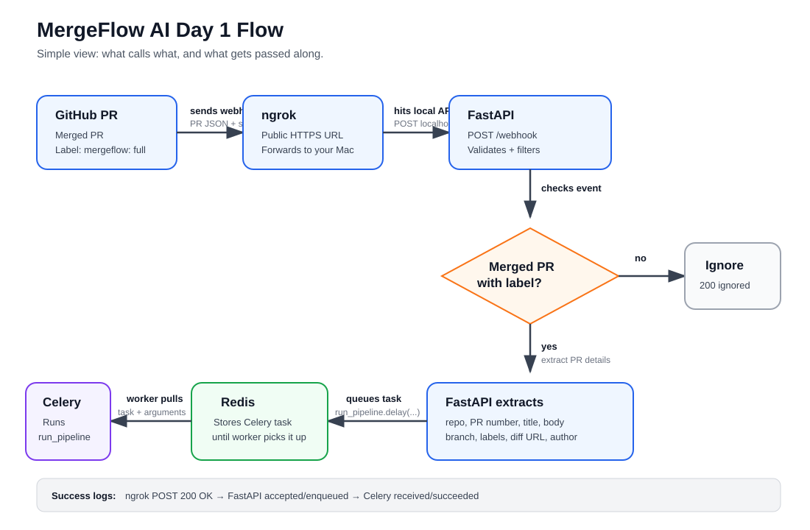
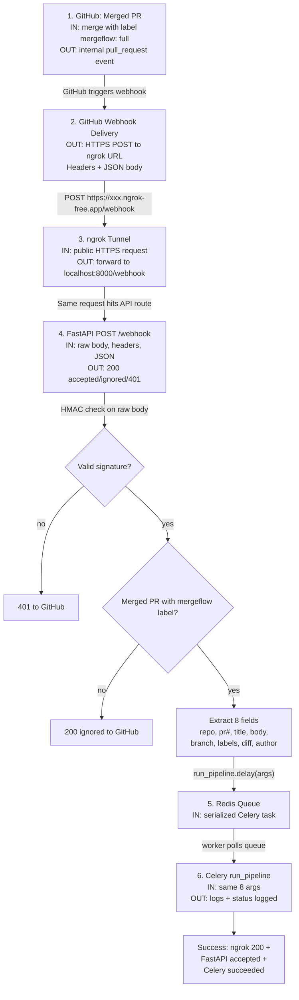

# Day 1 Testing Flow

This document explains how to test the complete Day 1 MergeFlow AI flow using a real GitHub repository.

Day 1 verifies one main thing:

GitHub merged PR webhook -> local FastAPI server -> Redis queue -> Celery worker

No real AI pipeline steps run yet. The worker only logs the PR metadata it receives.

## Workflow Diagram

This diagram shows the Day 1 flow at a high level: what calls what, and what gets passed along.



Read the diagram from left to right, then down through the decision and queue path.

If the image looks outdated, close and reopen the file or open `day1-workflow.svg` directly.

If your Markdown preview supports Mermaid, the editable version of the same workflow is also included below.



### Data Passed Through the Flow

GitHub sends the full webhook payload, but Day 1 extracts only the fields needed to start the pipeline:

| Field | Source in GitHub Payload | Passed To Celery As | Example |
| --- | --- | --- | --- |
| Repository name | `repository.full_name` | `repo_name` | `samee2612/mergeflow-test-repo` |
| PR number | `pull_request.number` | `pr_number` | `1` |
| PR title | `pull_request.title` | `pr_title` | `Test MergeFlow Day 1 webhook` |
| PR body | `pull_request.body` | `pr_body` | `Closes #12` |
| Branch name | `pull_request.head.ref` | `branch_name` | `test/mergeflow-day1` |
| MergeFlow labels | `pull_request.labels[].name` | `labels` | `['mergeflow: full']` |
| Diff URL | `pull_request.diff_url` | `diff_url` | `https://github.com/.../pull/1.diff` |
| Author | `pull_request.user.login` | `author` | `samee2612` |

### Component Responsibilities

| Component | What It Does | Input | Output |
| --- | --- | --- | --- |
| GitHub PR | Produces the real merge event | Merged PR with `mergeflow: full` label | Pull request webhook payload |
| GitHub Webhook | Sends the event to MergeFlow | PR event JSON + signature header | HTTPS `POST /webhook` |
| ngrok | Exposes local FastAPI to GitHub | Public HTTPS request | Local request to `localhost:8000` |
| FastAPI | Validates and filters webhook events | Raw webhook body, headers, JSON payload | `ignored` or `accepted` response |
| Redis | Holds queued background jobs | Celery task message | Task available to worker |
| Celery Worker | Runs the queued pipeline task | Extracted PR metadata | Logs metadata and returns `logged` |

## What You Need Running

For the local non-Docker setup, keep these services running:

1. Redis
2. FastAPI
3. Celery worker
4. ngrok

## Start Local Services

### 1. Start Redis

```bash
/opt/homebrew/opt/redis/bin/redis-server /opt/homebrew/etc/redis.conf
```

Healthy Redis log:

```text
Ready to accept connections tcp
```

### 2. Start FastAPI

From the MergeFlow project root:

```bash
cd /Users/sameeksharane/MergeFlow_AI
source .venv/bin/activate
export GITHUB_WEBHOOK_SECRET=local-dev-secret
export REDIS_URL=redis://localhost:6379/0
export CELERY_BROKER_URL=redis://localhost:6379/0
export CELERY_RESULT_BACKEND=redis://localhost:6379/0
uvicorn backend.main:app --host 0.0.0.0 --port 8000 --reload
```

Healthy FastAPI log:

```text
Uvicorn running on http://0.0.0.0:8000
Application startup complete.
```

Health check:

```bash
curl http://localhost:8000/health
```

Expected response:

```json
{"status":"ok"}
```

### 3. Start Celery Worker

From the MergeFlow project root:

```bash
cd /Users/sameeksharane/MergeFlow_AI
source .venv/bin/activate
export REDIS_URL=redis://localhost:6379/0
export CELERY_BROKER_URL=redis://localhost:6379/0
export CELERY_RESULT_BACKEND=redis://localhost:6379/0
celery -A backend.worker.celery_app worker --loglevel=info
```

Healthy Celery logs:

```text
Connected to redis://localhost:6379/0
celery@Mac.lan ready.
```

You should also see the registered task:

```text
[tasks]
  . run_pipeline
```

### 4. Start ngrok

```bash
ngrok http 8000
```

ngrok prints a public HTTPS URL like:

```text
https://abc123.ngrok-free.app -> http://localhost:8000
```

Your GitHub webhook URL is:

```text
https://abc123.ngrok-free.app/webhook
```

Important: free ngrok URLs change whenever ngrok restarts. If you restart ngrok, update the GitHub webhook URL.

## GitHub Test Repository Setup

### 1. Create a Test Repo

1. Go to GitHub.
2. Click New repository.
3. Name it something like `mergeflow-test-repo`.
4. Add a README.
5. Create the repo.

Clone it locally:

```bash
git clone https://github.com/YOUR_USERNAME/mergeflow-test-repo.git
cd mergeflow-test-repo
```

### 2. Create the MergeFlow Label

In the GitHub repo:

1. Go to Issues.
2. Go to Labels.
3. Click New label.
4. Name it exactly:

```text
mergeflow: full
```

Save the label.

### 3. Configure the Webhook

In the GitHub repo:

1. Go to Settings.
2. Go to Webhooks.
3. Click Add webhook.
4. Set Payload URL to your current ngrok webhook URL:

```text
https://YOUR_CURRENT_NGROK_URL/webhook
```

5. Set Content type:

```text
application/json
```

6. Set Secret:

```text
local-dev-secret
```

7. Choose Let me select individual events.
8. Select Pull requests.
9. Save the webhook.

GitHub may send a `ping` event immediately. MergeFlow should return `200 OK` and ignore it because it is not a pull request merge event.

## Create and Merge a Test PR

From the test repo:

```bash
git checkout main
git pull
git checkout -b test/mergeflow-day1
echo "MergeFlow Day 1 test - $(date)" >> README.md
git add README.md
git commit -m "Test MergeFlow Day 1 webhook"
git push -u origin test/mergeflow-day1
```

On GitHub:

1. Open a pull request from `test/mergeflow-day1` into `main`.
2. Add the label:

```text
mergeflow: full
```

3. Merge the pull request.

## Expected Logs

### ngrok Logs

ngrok should show a POST to `/webhook`:

```text
POST /webhook 200 OK
```

ngrok only confirms traffic reached your local server. It does not show the internal FastAPI or Celery logs.

### FastAPI Logs

For webhook events that are not the final merge event, you may see ignored logs.

For example, when the PR is opened:

```text
Received GitHub webhook event=pull_request action=opened repo=YOUR_USERNAME/mergeflow-test-repo pr_number=1
Ignoring pull request event because it is not a merged PR action=opened merged=False
```

When the label is added:

```text
Received GitHub webhook event=pull_request action=labeled repo=YOUR_USERNAME/mergeflow-test-repo pr_number=1
Ignoring pull request event because it is not a merged PR action=labeled merged=False
```

When the PR is merged, this is the success path:

```text
Received GitHub webhook event=pull_request action=closed repo=YOUR_USERNAME/mergeflow-test-repo pr_number=1
Accepted MergeFlow post-merge webhook repo=YOUR_USERNAME/mergeflow-test-repo pr_number=1 labels=['mergeflow: full']
Enqueuing post-merge pipeline job repo=YOUR_USERNAME/mergeflow-test-repo pr_number=1 labels=['mergeflow: full']
POST /webhook HTTP/1.1" 200 OK
```

### Celery Logs

The Celery worker should receive and complete the task:

```text
Task run_pipeline[...] received
Received pipeline job repo_name=YOUR_USERNAME/mergeflow-test-repo pr_number=1 pr_title=... pr_body=... branch_name=test/mergeflow-day1 labels=['mergeflow: full'] diff_url=https://github.com/YOUR_USERNAME/mergeflow-test-repo/pull/1.diff author=YOUR_USERNAME
Task run_pipeline[...] succeeded ... {'status': 'logged'}
```

## How to Confirm End to End

The Day 1 flow is working when all of these are true:

1. ngrok shows `POST /webhook 200 OK`.
2. FastAPI logs `Accepted MergeFlow post-merge webhook`.
3. FastAPI logs `Enqueuing post-merge pipeline job`.
4. Celery logs `Task run_pipeline received`.
5. Celery logs the repo name, PR number, PR title, branch, labels, diff URL, and author.
6. Celery logs `succeeded`.

## Troubleshooting

### No Logs After Merging a PR

Most likely cause: GitHub is still pointing to an old ngrok URL.

Check your current ngrok URL in the ngrok terminal. Then update the GitHub webhook Payload URL:

```text
https://CURRENT_NGROK_URL/webhook
```

After updating, either create another PR or use GitHub webhook Recent Deliveries and click Redeliver on the pull request event.

### FastAPI Says Address Already in Use

This means something is already running on port `8000`.

Check what owns the port:

```bash
lsof -nP -iTCP:8000 -sTCP:LISTEN
```

If it is an old Uvicorn process, stop it:

```bash
pkill -f "uvicorn backend.main:app"
```

Then restart FastAPI.

### ngrok Shows Requests But FastAPI Does Not Accept Them

Open GitHub webhook Recent Deliveries and inspect the response.

Common issues:

- Wrong webhook secret
- Missing `X-Hub-Signature-256`
- Webhook points to `/` instead of `/webhook`
- Content type is not `application/json`

### Celery Does Not Receive the Task

First confirm FastAPI accepted the merged PR:

```text
Accepted MergeFlow post-merge webhook
Enqueuing post-merge pipeline job
```

If those logs exist but Celery does not receive the task:

1. Confirm Redis is running.
2. Confirm Celery is connected to `redis://localhost:6379/0`.
3. Restart Celery.

### GitHub Ping Events Are Ignored

This is expected.

GitHub sends a `ping` event when a webhook is created or updated. MergeFlow ignores it because Day 1 only processes pull request events where:

```text
action == closed
pull_request.merged == true
label starts with mergeflow:
```

## Verified During Day 1 Testing

During Day 1 testing, we confirmed:

- Redis started locally.
- FastAPI health check returned `{"status":"ok"}`.
- Celery connected to Redis and registered `run_pipeline`.
- ngrok exposed `localhost:8000`.
- A real GitHub PR merge reached `/webhook`.
- FastAPI accepted the merged PR with `mergeflow: full`.
- FastAPI queued `run_pipeline`.
- Celery received and logged the task.
- Celery completed the task with `{"status": "logged"}`.

We also confirmed that if GitHub is pointed at an old ngrok URL, no new FastAPI or Celery logs appear after merging. Updating the GitHub webhook to the current ngrok URL fixes that.
