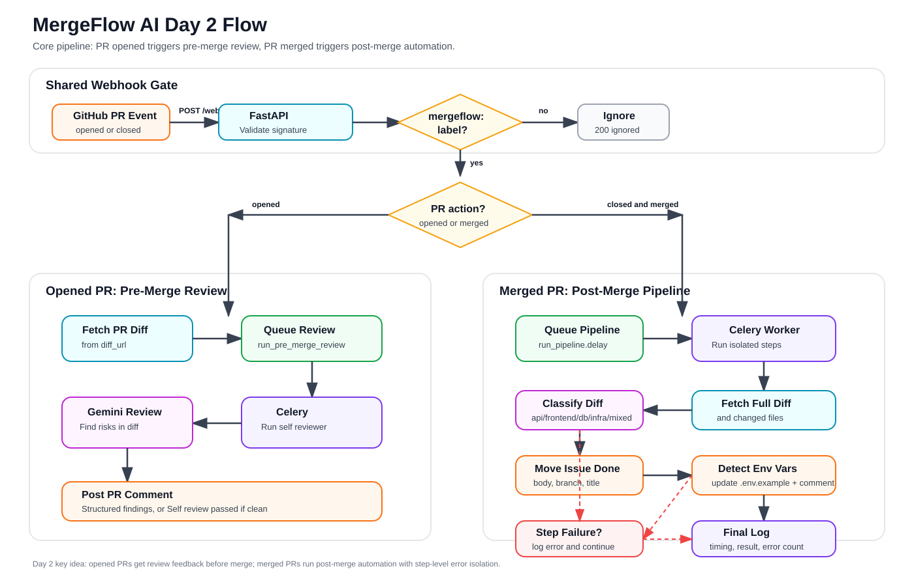
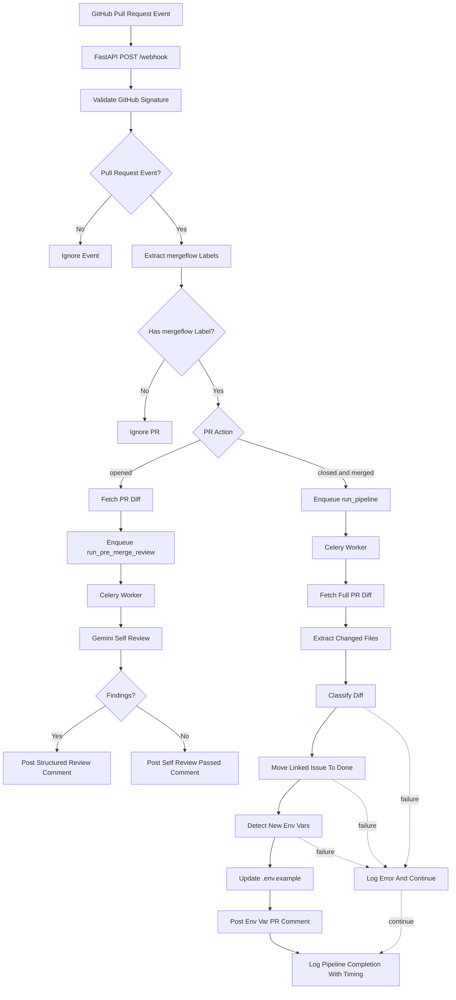

# Day 2 Summary

This document explains the Day 2 core pipeline work for MergeFlow AI. Day 1 created the webhook, Celery, Redis, and Docker foundation. Day 2 turns that foundation into the first real automation pipeline.

## What Day 2 Built

Day 2 added four core feature modules and wired them into the webhook and Celery worker:

1. PR opened with a `mergeflow:` label now triggers a Gemini-powered pre-merge self review.
2. PR merged with a `mergeflow:` label now fetches the full PR diff and runs the core post-merge pipeline.
3. The post-merge pipeline classifies the diff, moves linked GitHub issues to Done, and detects missing environment variables.
4. Each post-merge step is isolated with `try/except`, so one failed feature does not stop the rest of the pipeline.

## Day 2 Flow Diagram

This diagram shows the Day 2 flow at a high level: the shared webhook gate, the PR opened review path, and the PR merged automation path.



Read the diagram from top to bottom. The flow splits after MergeFlow confirms the PR has a `mergeflow:` label.

If the image looks outdated, close and reopen the file or open `day2-workflow.svg` directly.

If your Markdown preview supports Mermaid, the editable version of the same workflow is also included below.



The important split is the PR action:

- `opened` runs the pre-merge review path and posts feedback before merge.
- `closed` with `merged == true` runs the post-merge pipeline and performs automation after merge.

## Files And Functions

### `backend/classifier/diff_classifier.py`

This file implements the diff classifier.

Public function:

- `classify_diff(diff_text, changed_files)`: Uses Gemini to classify the PR diff. If Gemini fails, it falls back to deterministic file-path detection.

Helper functions:

- `_classify_with_gemini(diff_text, changed_files)`: Sends the changed files and truncated diff to Gemini.
- `_extract_response_text(response)`: Extracts text from the Gemini response.
- `_classify_from_files(changed_files)`: Fallback classifier based on filenames, paths, and extensions.
- `_detect_file_type(file_path)`: Classifies one file as API, frontend, database, infra, or unknown.
- `_has_any_signal(parts, keywords)`: Token-based keyword matching helper.
- `_is_api_spec(filename, suffix)`: Detects OpenAPI/Swagger YAML spec files.

### `backend/features/issue_mover.py`

This file implements linked issue detection and issue completion.

Public function:

- `move_issue_to_done(repo, pr_title, pr_body, branch_name)`: Finds a linked issue number and closes it as completed through the GitHub Issues API.

Helper functions:

- `_extract_issue_number(pr_title, pr_body, branch_name)`: Applies the three issue detection fallbacks in order.
- `_close_issue_as_completed(repo, issue_number)`: Calls GitHub `PATCH /repos/{repo}/issues/{issue_number}` with `state=closed` and `state_reason=completed`.
- `_get_github_token()`: Reads `GITHUB_TOKEN`, falling back to `GITHUB_PERSONAL_ACCESS_TOKEN`.
- `_github_headers(token)`: Builds GitHub REST API headers.

### `backend/features/env_detector.py`

This file implements environment variable detection, PR commenting, and `.env.example` updates.

Public function:

- `detect_new_env_vars(diff_text, repo, pr_number)`: Scans new diff lines for env var references, compares them with `.env.example`, commits missing keys, and comments on the PR.

Helper functions:

- `_extract_env_vars_from_diff(diff_text)`: Finds new env vars in added diff lines.
- `_is_added_diff_line(line)`: Filters real added lines and skips diff metadata.
- `_get_pull_request(repo, pr_number, token)`: Fetches PR metadata to find the head repo and branch.
- `_get_env_example(repo, branch, token)`: Fetches `.env.example` from GitHub contents API.
- `_extract_existing_env_vars(env_example_content)`: Parses already documented env vars.
- `_post_pr_comment(repo, pr_number, new_vars, token)`: Posts the missing env vars comment.
- `_commit_env_example_update(repo, branch, env_example, new_vars, token)`: Commits the updated `.env.example`.
- `_append_env_vars(env_example_content, new_vars)`: Adds empty placeholders for missing keys.
- `_get_github_token()`: Reads `GITHUB_TOKEN`, falling back to `GITHUB_PERSONAL_ACCESS_TOKEN`.
- `_github_headers(token)`: Builds GitHub REST API headers.

### `backend/features/self_reviewer.py`

This file implements the pre-merge Gemini review bot.

Public function:

- `run_self_review(repo, pr_number, diff_text)`: Runs Gemini analysis, formats the findings, and posts a GitHub PR comment.

Helper functions:

- `_analyze_diff_with_gemini(diff_text)`: Sends the diff to Gemini and asks for strict JSON findings.
- `_extract_response_text(response)`: Extracts text from the Gemini response.
- `_validate_findings(raw_findings)`: Validates Gemini JSON into structured findings.
- `_optional_string(value)`: Normalizes optional file path fields.
- `_format_review_comment(findings)`: Builds the final GitHub comment body.
- `_format_finding(index, finding)`: Formats one finding with severity, file, explanation, and fix.
- `_format_location(finding)`: Builds `file:line` references when available.
- `_post_pr_comment(repo, pr_number, body)`: Posts the review comment through GitHub.
- `_get_github_token()`: Reads `GITHUB_TOKEN`, falling back to `GITHUB_PERSONAL_ACCESS_TOKEN`.
- `_github_headers(token)`: Builds GitHub REST API headers.

### `backend/worker.py`

This file now runs the Day 2 pipeline in Celery.

Celery tasks:

- `run_pipeline(repo_name, pr_number, pr_title, pr_body, branch_name, labels, diff_url, author)`: Runs the post-merge pipeline.
- `run_pre_merge_review(repo, pr_number, diff_text)`: Runs the pre-merge self-review task.

Helper functions:

- `_run_pipeline_step(step_name, step, results, default=None)`: Runs one pipeline step with timing, logging, and error isolation.
- `_fetch_pr_diff(diff_url)`: Fetches the full PR diff using GitHub headers.
- `_extract_changed_files(diff_text)`: Parses changed file paths from the unified diff.
- `_github_headers()`: Builds headers for fetching the diff.

### `backend/main.py`

This file now routes both PR opened and PR merged webhook events.

New or updated functions:

- `github_webhook(...)`: Now handles `opened` and merged `closed` pull request events.
- `fetch_pr_diff(diff_url)`: Fetches the PR diff before enqueueing pre-merge review.
- `github_diff_headers()`: Builds headers for diff fetches.
- `enqueue_pre_merge_review(payload, mergeflow_labels)`: Fetches the diff and enqueues `run_pre_merge_review.delay(...)`.
- `enqueue_post_merge_job(payload, mergeflow_labels)`: Existing post-merge enqueue path, still used for merged PRs.
- `extract_mergeflow_labels(labels)`: Existing label helper, now used by both opened and merged paths.

### `.env.example`

This file was updated with:

- `GITHUB_TOKEN=`

The existing `GITHUB_PERSONAL_ACCESS_TOKEN=` remains supported as a compatibility fallback.

### `DAY2_SUMMARY.md`

This file documents the Day 2 implementation.

## Complete Pipeline Flow

### PR Opened Flow

This flow powers the pre-merge self-review bot.

1. GitHub sends a pull request webhook to `POST /webhook`.
2. FastAPI validates `X-Hub-Signature-256` using `GITHUB_WEBHOOK_SECRET`.
3. FastAPI logs the event type, action, repo, and PR number.
4. FastAPI ignores non-`pull_request` events.
5. FastAPI extracts labels that start with `mergeflow:`.
6. If `action == "opened"` and there is no `mergeflow:` label, the event is ignored.
7. If `action == "opened"` and a `mergeflow:` label exists, FastAPI fetches the PR diff from `pull_request.diff_url`.
8. FastAPI enqueues `run_pre_merge_review.delay(repo, pr_number, diff_text)`.
9. Celery runs `run_pre_merge_review`.
10. `self_reviewer.run_self_review` sends the diff to Gemini.
11. Gemini returns strict JSON findings.
12. MergeFlow formats the findings as a GitHub PR comment.
13. If Gemini finds no issues, MergeFlow posts a clean `Self review passed` comment.

### PR Merged Flow

This flow powers the post-merge core pipeline.

1. GitHub sends a pull request webhook to `POST /webhook`.
2. FastAPI validates `X-Hub-Signature-256`.
3. FastAPI logs the event type, action, repo, and PR number.
4. FastAPI ignores non-`pull_request` events.
5. FastAPI checks for `action == "closed"` and `pull_request.merged == true`.
6. FastAPI extracts labels that start with `mergeflow:`.
7. If there is no `mergeflow:` label, the merged PR is ignored.
8. FastAPI extracts repo name, PR number, title, body, branch name, labels, diff URL, and author.
9. FastAPI enqueues `run_pipeline.delay(...)`.
10. Celery starts `run_pipeline` and records a pipeline start time.
11. Worker fetches the full PR diff from `diff_url`.
12. Worker parses changed files from the diff.
13. Worker runs `diff_classifier.classify_diff(diff_text, changed_files)`.
14. Worker runs `issue_mover.move_issue_to_done(repo, pr_title, pr_body, branch_name)`.
15. Worker runs `env_detector.detect_new_env_vars(diff_text, repo, pr_number)`.
16. Each step logs completion. If any step fails, the error is recorded and later steps still run.
17. Worker logs overall pipeline completion with elapsed time, classification, issue number, env var count, and error count.

## Diff Classifier Behavior

The classifier returns exactly one of:

- `api`
- `frontend`
- `database`
- `infra`
- `mixed`

Gemini is the primary classifier. It receives:

- The list of changed files.
- A truncated diff body.
- Instructions to return only one lowercase label.

Fallback detection runs if Gemini fails or returns an invalid value.

Fallback signals:

- `api`: route files, controllers, handlers, endpoints, OpenAPI/Swagger YAML files.
- `frontend`: React, Vue, HTML, CSS, SCSS, components, pages, views, UI files.
- `database`: migrations, schema files, ORM models, Prisma, Sequelize, Alembic, SQL files.
- `infra`: `.env`, Dockerfile, docker-compose, CI workflow YAML, config files, Terraform, Helm, Kubernetes.
- `mixed`: more than one category detected, or no category confidently detected.

## Issue Linking Detection

`move_issue_to_done` checks for a linked issue in this exact order:

1. PR body pattern: `Closes #123` or `Fixes #123`.
2. Branch name pattern: `feat/123-anything` or `fix/123-anything`.
3. PR title pattern: `[#123] anything`.

If an issue number is found, MergeFlow calls the GitHub Issues API to close it as completed.

If no issue number is found, MergeFlow logs that no linked issue was found and returns `None`.

## Environment Variables

Required for Day 2:

- `GITHUB_TOKEN`: GitHub token used for diff fetches, PR comments, issue updates, PR metadata reads, and `.env.example` commits.
- `GITHUB_WEBHOOK_SECRET`: Shared secret used to validate GitHub webhook signatures.
- `GEMINI_API_KEY`: Gemini API key used by the diff classifier and self-review bot.
- `GEMINI_MODEL`: Gemini model name. Defaults to `gemini-2.5-pro`.
- `REDIS_URL`: Redis broker/result URL used by Celery. Defaults to `redis://redis:6379/0`.

Compatibility fallback:

- `GITHUB_PERSONAL_ACCESS_TOKEN`: Still supported if `GITHUB_TOKEN` is not set.

Still present from Day 1 or future days:

- `APP_ENV`
- `BACKEND_HOST`
- `BACKEND_PORT`
- `GITHUB_REPO_URL`
- `CELERY_BROKER_URL`
- `CELERY_RESULT_BACKEND`
- `NOTION_API_KEY`
- `NOTION_WORKSPACE_ID`
- `NOTION_DATABASE_ID`
- `SENDGRID_API_KEY`
- `SENDGRID_FROM_EMAIL`
- `SENDGRID_RECIPIENT_EMAILS`
- `CHROMA_PERSIST_DIRECTORY`
- `EMBEDDING_MODEL`
- `VITE_BACKEND_URL`

## Manual Testing

### Start The System

1. Copy `.env.example` to `.env`.
2. Fill in `GITHUB_TOKEN`, `GITHUB_WEBHOOK_SECRET`, and `GEMINI_API_KEY`.
3. Run Docker Compose:

```bash
docker compose up
```

4. Confirm the API is healthy:

```bash
curl http://localhost:8000/health
```

Expected response:

```json
{"status":"ok"}
```

### Test The Diff Classifier Locally

Run:

```bash
python - <<'PY'
from backend.classifier.diff_classifier import _classify_from_files

print(_classify_from_files(["backend/routes/users.py"]))
print(_classify_from_files(["frontend/src/pages/Home.tsx"]))
print(_classify_from_files(["migrations/001_create_users.sql"]))
print(_classify_from_files([".github/workflows/ci.yml"]))
print(_classify_from_files(["backend/controllers/users.py", "frontend/src/App.tsx"]))
PY
```

Expected output:

```text
api
frontend
database
infra
mixed
```

To test Gemini classification, call `classify_diff(diff_text, changed_files)` with a real diff and a valid `GEMINI_API_KEY`.

### Test Issue Linking Locally

Run:

```bash
python - <<'PY'
from backend.features.issue_mover import _extract_issue_number

print(_extract_issue_number("Title", "Closes #123", "feat/999-other"))
print(_extract_issue_number("Title", "", "feat/456-add-login"))
print(_extract_issue_number("[#789] Add dashboard", "", "chore/no-issue"))
PY
```

Expected output:

```text
123
456
789
```

To test live issue movement:

1. Create a GitHub issue in the connected repo.
2. Open a PR with `Closes #<issue_number>` in the body.
3. Add a `mergeflow:` label.
4. Merge the PR.
5. Confirm the issue is closed as completed.

### Test Env Var Detection Locally

Run:

```bash
python - <<'PY'
from backend.features.env_detector import _extract_env_vars_from_diff

diff = '''
++ b/app.py
DATABASE_URL = os.getenv("DATABASE_URL")
secret = os.environ["API_SECRET"]
const key = process.env.NEXT_PUBLIC_API_URL
NEW_FROM_ENV_FILE=value
'''

print(sorted(_extract_env_vars_from_diff(diff)))
PY
```

Expected output:

```text
['API_SECRET', 'DATABASE_URL', 'NEXT_PUBLIC_API_URL', 'NEW_FROM_ENV_FILE']
```

To test live env detection:

1. Open a PR that adds a new env var reference, such as `os.getenv("NEW_SERVICE_TOKEN")`.
2. Make sure `.env.example` does not contain `NEW_SERVICE_TOKEN=`.
3. Add a `mergeflow:` label.
4. Merge the PR.
5. Confirm MergeFlow commits `NEW_SERVICE_TOKEN=` to `.env.example`.
6. Confirm MergeFlow posts a PR comment listing the new variable.

### Test Self Review Locally

Run helper formatting checks:

```bash
python - <<'PY'
from backend.features.self_reviewer import _format_review_comment

print(_format_review_comment([]))
PY
```

Expected output contains:

```text
Self review passed
```

To test live self review:

1. Open a PR that adds a `console.log`, `print`, `TODO`, hardcoded URL, or new API call without error handling.
2. Add a `mergeflow:` label before opening the PR, or open a new PR with the label already present.
3. Confirm FastAPI receives an `opened` pull request webhook.
4. Confirm Celery runs `run_pre_merge_review`.
5. Confirm a structured MergeFlow AI self-review comment appears on the PR.

### Test The Opened PR Webhook Flow

1. Start the API, Redis, and worker with Docker Compose.
2. Expose the API with ngrok:

```bash
ngrok http 8000
```

3. Configure the GitHub webhook URL as:

```text
https://<ngrok-url>/webhook
```

4. Select pull request events.
5. Open a PR with a `mergeflow:` label.
6. Expected logs:

```text
Received GitHub webhook event=pull_request action=opened
Accepted MergeFlow pre-merge webhook
Fetching diff for pre-merge self review
Enqueuing pre-merge self review job
Completed pre-merge self review
```

7. Expected GitHub behavior: a self-review PR comment is posted.

### Test The Merged PR Pipeline Flow

1. Open a PR with a `mergeflow:` label.
2. Include an issue link in the PR body, branch, or title.
3. Add a new env var reference that is missing from `.env.example`.
4. Merge the PR.
5. Expected logs:

```text
Received GitHub webhook event=pull_request action=closed
Accepted MergeFlow post-merge webhook
Enqueuing post-merge pipeline job
Starting pipeline
Completed pipeline step step=fetch_diff
Completed pipeline step step=classify_diff
Completed pipeline step step=move_issue_to_done
Completed pipeline step step=detect_new_env_vars
Completed pipeline
```

6. Expected GitHub behavior:

- The linked issue is closed as completed.
- `.env.example` is updated with any missing variables.
- A PR comment lists new required environment variables.

### Test Pipeline Error Isolation

The worker intentionally keeps running if one step fails. To verify:

1. Temporarily remove `GEMINI_API_KEY`.
2. Trigger a merged PR with a `mergeflow:` label.
3. The classifier should fail or fall back, but issue movement and env detection should still run.
4. Check the final pipeline log for `error_count`.

## Day 2 Verification Commands

These commands were used during implementation:

```bash
python -m py_compile backend/classifier/diff_classifier.py
python -m py_compile backend/features/issue_mover.py
python -m py_compile backend/features/env_detector.py
python -m py_compile backend/features/self_reviewer.py
python -m py_compile backend/worker.py
python -m py_compile backend/main.py
```

The implementation was also checked with local helper tests for:

- Diff classifier fallback behavior.
- Issue extraction fallback order.
- Env var regex extraction and `.env.example` appending.
- Self-review comment formatting.
- Worker changed-file extraction.
- Worker error isolation.
- Pre-merge review enqueue behavior.
